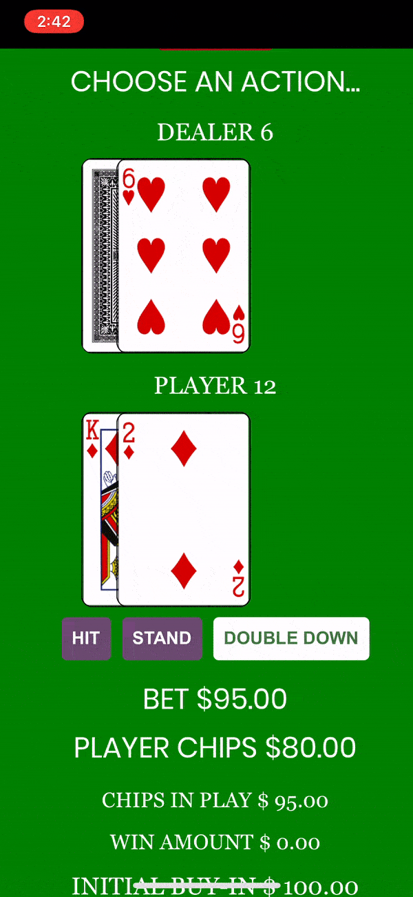

## Blackjack created with React

This is my personal recreation of a blackjack application bootstrapped with create-react-app. It was created from scratch with only React and pulls cards from
the Deck of Cards API. It was built without state management and using class based components.

## Play the game

Play blackjack at https://jteng1.github.io/blackjack/

## Demo

## Purpose

I wanted to create a blackjack simulation that I could practice on with a statistics and betting with chips. I also wanted to create it purely in React with no state management to understand the idea of a "Single Source of Truth" and to get a better feel of managing state and passing properties without utilizing a state management system like Redux.

## Rules

Dealer stands on 17 
Blackjack pays 3:2 
Insurance pays 2:1 (Not available yet)  
Max of one split hand (Not available yet)  
Push on both player and dealer blackjacks 
Six decks in the shoe 
Shoe is shuffled after 50% of the cards are dealt 

## Installing the app

Clone this repo into a directory 
cd directory 
npm install 
npm start 
application will run on localhost:3000 

## Versions

1.2.0 - Made UI more mobile friendly
1.1.0 - Released playable build on github-pages 
1.0.0 - Added functionality for game 

## In Progress

Redo the UI/UX for application 
Add split functionality 
Add insurance option 
Add deck count/customization 
Add high score 
Add card counting stats  
Make responsive 

## Known Bugs
